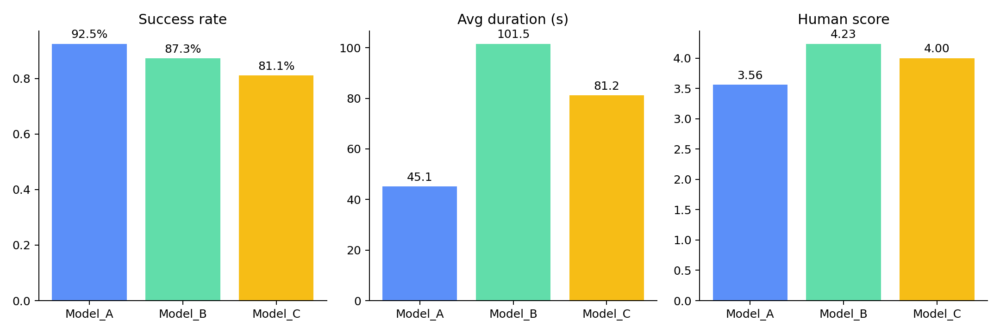
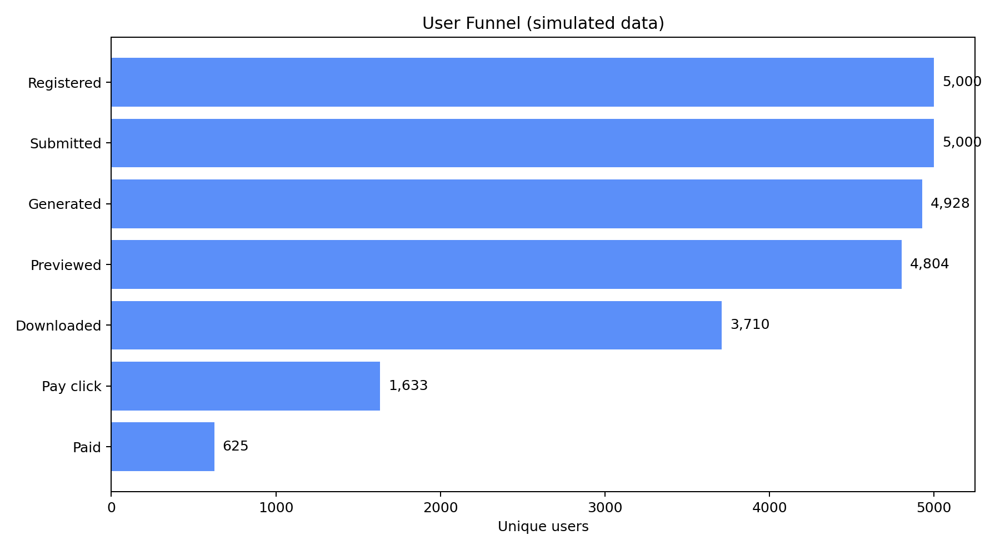

# AI 视频生成产品用户行为与商业化转化分析

这是一个面向数据分析 / 商业分析 / AI 产品岗位的个人项目。项目模拟 AI 视频产品从注册、提交 Prompt、视频生成、预览下载、二次编辑到付费转化的业务链路，使用 SQL、Python、统计检验和 Streamlit 完成可复现分析闭环。

> 数据边界：所有用户、行为、订单、模型评分与实验数据均为固定随机种子生成的模拟数据；结论用于证明分析方法与业务推理能力，不代表任何真实公司的经营结果。



## 项目结果

- 构建 7 张业务表，覆盖 5,000 名用户、320 条 Prompt、21,508 次生成任务、44,631 条行为事件与 2,029 次支付尝试。
- 总体生成成功率 87.73%，平均生成时长 75.8 秒，成功任务下载率 38.19%，二次编辑率 13.30%。
- Model_A 成功率最高（92.45%）且平均耗时最短（45.1 秒）；Model_B 人工评分最高（4.23/5），但平均耗时 101.5 秒；Model_C 风格分最高（4.45/5），投诉率也最高（4.46%）。
- 等待时长 ≤45 秒的成功任务下载率为 48.10%，>120 秒时降至 14.93%，相差 33.17 个百分点。
- 商品广告的单任务收入最高（¥0.96），品牌宣传次之（¥0.85），支持按 Prompt 商业意图差异化展示付费权益。
- A/B 实验中，实验组付费点击率由 26.71% 提升至 37.68%，绝对提升 10.97 个百分点（双侧比例检验 p<0.001）；用户付费率由 9.17% 提升至 15.12%。



## 业务建议

1. Model_A 承接新用户和速度敏感场景，降低首次生成等待成本。
2. Model_B 分流至商品广告、品牌宣传等高商业意图场景，并展示预计等待时间。
3. Model_C 仅在二次元、短剧等风格化场景灰度使用，并配置失败回退策略。
4. 商业化入口优先对高商业意图 Prompt 展示，避免对所有用户统一打扰。
5. 完成页改版先灰度放量；真实实验需继续观察长期留存、退款、实验污染和收入分布偏斜。

## 技术实现

- SQLite / SQL：10 组业务查询，覆盖 CTE、窗口函数、漏斗、留存、模型对比、实验指标和异动归因。
- Python / pandas：数据生成、质量校验、指标计算、模型与 Prompt 价值分析。
- scipy：两比例 z 检验、样本比例失衡检查和收入均值辅助检验。
- Plotly / Streamlit：五个主题页的交互式业务看板。
- matplotlib：输出可嵌入报告的静态图表。

## 项目结构

```text
ai-video-product-analytics/
├── app.py                         # Streamlit 看板
├── run_pipeline.py                # 一键复现完整流程
├── data/
│   ├── raw/                       # 7 张模拟业务表
│   ├── processed/                 # 分析结果表与 summary.json
│   └── ai_video.db                # SQLite 数据库
├── sql/                           # 10 组可执行 SQL
├── src/
│   ├── generate_mock_data.py      # 固定种子生成数据
│   ├── data_quality_check.py      # 主外键、时间与业务规则校验
│   ├── create_database.py         # CSV 导入 SQLite
│   ├── analysis.py                # Python 分析与显著性检验
│   ├── weekly_report.py           # 自动生成业务报告
│   └── create_assets.py           # 静态图表
├── reports/analysis_report.md     # 完整结论与策略建议
├── docs/                          # 数据字典与模拟规则
├── tests/validate_project.py      # SQL/Python 交叉核验
└── assets/                        # 分析图表
```

## 快速运行

建议使用 Python 3.10—3.12。

```bash
python -m venv .venv
source .venv/bin/activate       # Windows: .venv\Scripts\activate
pip install -r requirements.txt
python run_pipeline.py
python tests/validate_project.py
streamlit run app.py
```

完整管道会依次生成数据、执行质量校验、创建 SQLite 数据库、完成 Python 分析、生成报告和图表。

## 指标口径

- 生成成功率 = 成功任务数 / 全部提交任务数
- 下载率 = 发生下载行为的成功任务数 / 成功任务数
- 用户付费率 = 至少有一笔成功订单的用户数 / 实验有效用户数
- ARPU = 成功订单收入 / 活跃用户数
- 有效视频生成用户 = 至少成功生成一次，并发生下载、分享、收藏、二次编辑或再次生成的用户
- D1 留存 = D0 提交过生成任务且在注册后第 1 天再次提交的用户 / D0 生成用户

所有多表指标均先聚合到任务或用户粒度，再进行 JOIN，防止行为日志和订单表的一对多关系放大分母。

## 验证情况

- 7 张表的主键、外键、时间顺序、评分范围与业务约束全部通过。
- 失败任务不存在下载、分享等非法成功后行为。
- 每笔订单均可追溯到付费点击，每个成功任务均有一条模型评分。
- 10 个 SQL 文件均可在 SQLite 执行并返回结果。
- Python 与 SQL 的模型、漏斗、收入和 A/B 核心指标已交叉核验一致。
- Streamlit 服务已完成启动级烟雾测试。

## 项目局限

模拟规则预先植入了模型差异、商业意图和实验效果，因此统计显著性只能证明分析流程正确，不能证明策略对真实产品有效。项目也不能替代真实埋点治理、大规模数仓、实验平台和跨团队协作经验。
